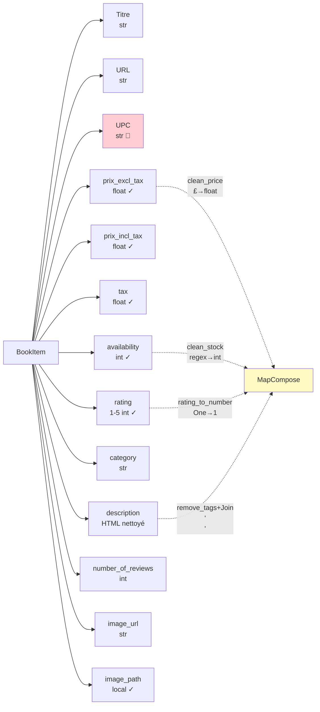
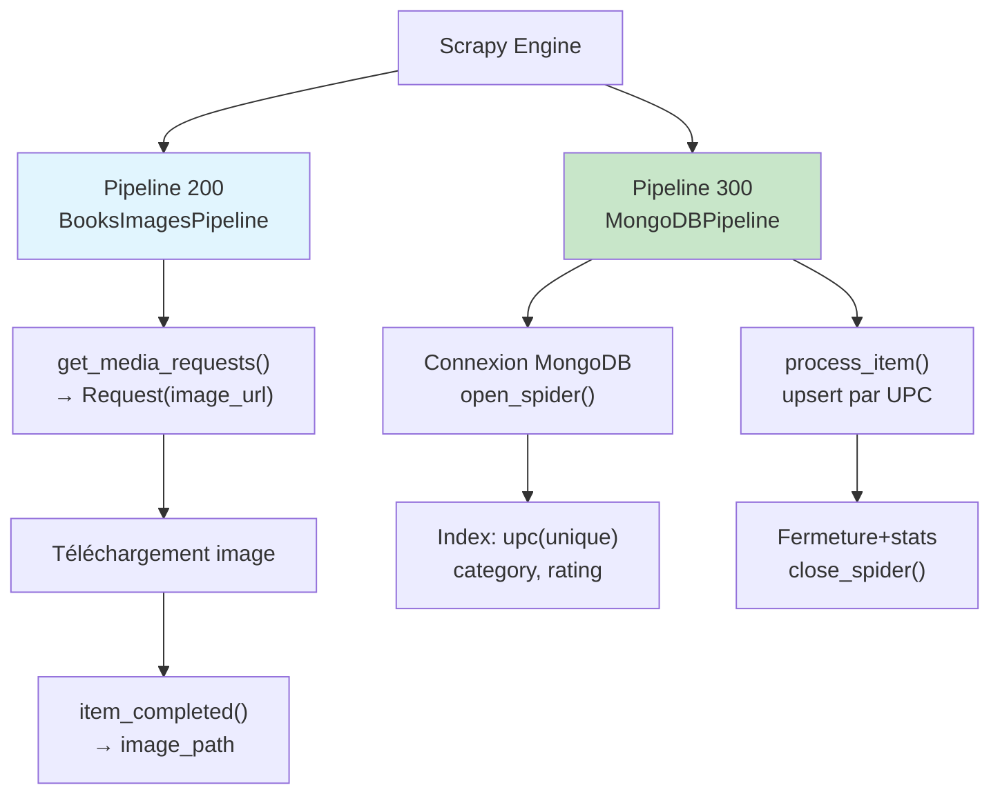

# 🏗️ Architecture technique - Books to MongoDB
Documentation détaillée de l'architecture du projet, des composants et des flux de données.
## 🎯 Vue d'ensemble
### Stack technique
```
┌─────────────────────────────────────┐
│         Application Layer           │
│    ┌─────────────────────────┐      │
│    │   Spider (mongo.py)     │      │
│    └─────────────────────────┘      │
└─────────────────────────────────────┘
                 │
                 ▼
┌─────────────────────────────────────┐
│         Processing Layer            │
│    ┌──────────┐  ┌──────────┐       │
│    │  Items   │  │Processors│       │
│    └──────────┘  └──────────┘       │
└─────────────────────────────────────┘
                 │
                 ▼
┌─────────────────────────────────────┐
│         Pipeline Layer              │
│    ┌──────────┐  ┌──────────┐       │
│    │  Images  │  │ MongoDB  │       │
│    └──────────┘  └──────────┘       │
└─────────────────────────────────────┘
                 │
                 ▼
┌─────────────────────────────────────┐
│         Storage Layer               │
│    ┌──────────┐  ┌──────────┐       │
│    │   FS     │  │ MongoDB  │       │
│    │ (images) │  │   DB     │       │
│    └──────────┘  └──────────┘       │
└─────────────────────────────────────┘
```
### Technologies
* **Scrapy 2.11+** : Framework de scraping
* **PyMongo 4.0+** : Driver MongoDB
* **Pillow 10.0+** : Traitement d'images
* **Python 3.8+** : Langage
## 🕸️ Architecture Scrapy
### Cycle de vie d'une requête
```
┌─────────────────────────────────────────────────────┐
│  1. start_urls                                      │
│     └──> parse()                                    │
│            └──> parse_category()                    │
│                   └──> parse_book()                 │
│                          └──> yield Item            │
└─────────────────────────────────────────────────────┘
                          │
                          ▼
┌─────────────────────────────────────────────────────┐
│  2. Item Processors                                 │
│     ├──> clean_price()                              │
│     ├──> clean_stock()                              │
│     ├──> rating_to_number()                         │
│     └──> remove_tags()                              │
└─────────────────────────────────────────────────────┘
                          │
                          ▼
┌─────────────────────────────────────────────────────┐
│  3. Pipelines (order: 200, 300)                     │
│     ├──> BooksImagesPipeline (200)                  │
│     │      └──> Download image                      │
│     │           └──> Save to images/full/           │
│     │                └──> Add image_path to item    │
│     │                                               │
│     └──> MongoDBPipeline (300)                      │
│            └──> upsert to MongoDB                   │
│                 └──> Log statistics                 │
└─────────────────────────────────────────────────────┘
```
### Priorité des pipelines
L'ordre est crucial :
1. **BooksImagesPipeline (200)** : S'exécute en premier pour télécharger l'image
2. **MongoDBPipeline (300)** : S'exécute après pour avoir `image_path` complet
## 🧩 Composants détaillés
### 1. Spider : `mongo.py`
**Responsabilités** :
* Extraction des URLs de catégories
* Navigation dans la pagination
* Extraction des détails de chaque livre
* Application des filtres (catégorie, pages)
**Méthodes principales** :
```py
parse(response)
├── Extrait les catégories du menu
├── Applique le filtre de catégorie
└── yield response.follow() → parse_category

parse_category(response)
├── Extrait les livres de la page
├── yield response.follow() → parse_book
└── Gère la pagination (next page)

parse_book(response)
├── Utilise ItemLoader pour extraire les données
├── Applique les processeurs automatiquement
└── yield item → Pipelines
```
**Gestion de la pagination** :
```py
# Détection automatique du bouton "Next"
next_page = response.xpath('//li[@class="next"]/a/@href').get()

# Vérification de la limite
if self.max_pages and self.pages_scraped >= self.max_pages:
    return

# Suivi automatique
yield response.follow(next_page, callback=self.parse_category)
```
### 2. Items : `items.py`
**Structure BookItem** :

**Processeurs personnalisés** :
1. **clean_price()** :
   ```py
   "£51.77" → 51.77 (float)
   ```
2. **clean_stock()** :
   ```py
   "In stock (22 available)" → 22 (int)
   ```
3. **rating_to_number()** :
   ```py
   "Three" → 3 (int)
   ```
4. **remove_tags() + Join()** :
   ```py
   "<p>Text</p><p>More</p>" → "Text\nMore"
   ```
### 3. Pipelines : `pipelines.py`
**Architecture des pipelines** :

#### 3.1 MongoDBPipeline
**Cycle de vie** :
```py
open_spider()
├── Connexion à MongoDB
├── Création des index
│   ├── upc (unique)
│   ├── category
│   └── rating
└── Log de confirmation

process_item()
├── Conversion item → dict
├── Upsert dans MongoDB
│   └── Update si upc existe
│   └── Insert si nouveau
└── Return item (pour pipeline suivant)

close_spider()
├── Statistiques finales
└── Fermeture connexion
```
**Stratégie d'upsert** :
```py
result = db.books.update_one(
    {'upc': item['upc']},      # Critère de recherche
    {'$set': item_dict},        # Données à mettre à jour
    upsert=True                 # Créer si inexistant
)
```
**Avantages** :
- ✅ Pas de doublons (upc unique)
- ✅ Mises à jour automatiques
- ✅ Idempotent (re-scraping safe)
#### 3.2 BooksImagesPipeline
**Héritage** : `ImagesPipeline` (Scrapy built-in)  
**Processus** :
```py
get_media_requests()
├── Extrait image_url de l'item
├── Validation URL (http/https)
└── yield scrapy.Request(url)

# Scrapy télécharge automatiquement

item_completed()
├── Vérifie le succès du téléchargement
├── Ajoute image_path à l'item
└── Return item modifié
```
**Nommage automatique** :
```
image_url: https://books.toscrape.com/media/cache/2c/da/2cdad67c44b002e7ead0cc35693c0e8b.jpg
          ↓ SHA1 hash
image_path: full/2cdad67c44b002e7ead0cc35693c0e8b.jpg
```
### 4. Configuration : `settings.py`
**Sections principales** :

```py
# 1. Identité du bot
BOT_NAME = "b2mongo"
USER_AGENT = "Mozilla/5.0..."

# 2. Politesse
ROBOTSTXT_OBEY = True
DOWNLOAD_DELAY = 0.5
CONCURRENT_REQUESTS_PER_DOMAIN = 2

# 3. Connexion MongoDB
MONGO_URI = 'mongodb://localhost:27017/'
MONGO_DATABASE = 'books_toscrape'

# 4. Stockage images
IMAGES_STORE = 'images'

# 5. Retry & Timeout
RETRY_TIMES = 3
DOWNLOAD_TIMEOUT = 30

# 6. Pipelines (ordre d'exécution)
ITEM_PIPELINES = {
    'b2mongo.pipelines.BooksImagesPipeline': 200,
    'b2mongo.pipelines.MongoDBPipeline': 300,
}
```
## 🔄 Flux de données
### Diagramme de flux complet
```
┌─────────────────────────────────────────────────────────────┐
│  START                                                      │
│    │                                                        │
│    ▼                                                        │
│  start_urls = ["https://books.toscrape.com/"]               │
└─────────────────────────────────────────────────────────────┘
                          │
                          ▼
┌─────────────────────────────────────────────────────────────┐
│  parse(response)                                            │
│    ├─ Extract categories (sidebar menu)                     │
│    ├─ Filter by category (if specified)                     │
│    └─ For each category:                                    │
│         └─ yield response.follow() → parse_category         │
└─────────────────────────────────────────────────────────────┘
                          │
                          ▼
┌─────────────────────────────────────────────────────────────┐
│  parse_category(response)                                   │
│    ├─ Extract book URLs (20 per page)                       │
│    ├─ For each book:                                        │
│    │    └─ yield response.follow() → parse_book             │
│    │                                                        │
│    └─ Pagination:                                           │
│         ├─ Check max_pages limit                            │
│         └─ If next page exists:                             │
│              └─ yield response.follow() → parse_category    │
└─────────────────────────────────────────────────────────────┘
                          │
                          ▼
┌─────────────────────────────────────────────────────────────┐
│  parse_book(response)                                       │
│    ├─ ItemLoader extracts all fields:                       │
│    │    ├─ title, url, upc, category                        │
│    │    ├─ prices (with clean_price processor)              │
│    │    ├─ availability (with clean_stock processor)        │
│    │    ├─ rating (with rating_to_number processor)         │
│    │    ├─ description (with remove_tags processor)         │
│    │    └─ image_url                                        │
│    │                                                        │
│    └─ yield loader.load_item()                              │
└─────────────────────────────────────────────────────────────┘
                          │
                          ▼
┌─────────────────────────────────────────────────────────────┐
│  ITEM PROCESSING                                            │
│    ├─ Input processors execute:                             │
│    │    ├─ clean_price: "£51.77" → 51.77                    │
│    │    ├─ clean_stock: "In stock (22)" → 22                │
│    │    ├─ rating_to_number: "Three" → 3                    │
│    │    └─ remove_tags: "<p>Text</p>" → "Text"              │
│    │                                                        │
│    └─ Output processors execute:                            │
│         ├─ TakeFirst(): list → single value                 │
│         └─ Join('\n'): list → concatenated string           │
└─────────────────────────────────────────────────────────────┘
                          │
                          ▼
┌─────────────────────────────────────────────────────────────┐
│  BooksImagesPipeline (priority: 200)                        │
│    ├─ get_media_requests():                                 │
│    │    ├─ Extract image_url                                │
│    │    ├─ Validate URL                                     │
│    │    └─ yield scrapy.Request(image_url)                  │
│    │                                                        │
│    ├─ [Scrapy downloads image]                              │
│    │                                                        │
│    └─ item_completed():                                     │
│         ├─ Check download success                           │
│         ├─ Add image_path to item                           │
│         └─ Return modified item                             │
└─────────────────────────────────────────────────────────────┘
                          │
                          ▼
┌─────────────────────────────────────────────────────────────┐
│  MongoDBPipeline (priority: 300)                            │
│    ├─ Convert item to dict                                  │
│    ├─ Upsert to MongoDB:                                    │
│    │    db.books.update_one(                                │
│    │        {'upc': item['upc']},                           │
│    │        {'$set': item_dict},                            │
│    │        upsert=True                                     │
│    │    )                                                   │
│    └─ Log result (inserted/updated)                         │
└─────────────────────────────────────────────────────────────┘
                          │
                          ▼
┌─────────────────────────────────────────────────────────────┐
│  END                                                        │
│    └─ Item stored in MongoDB + Image saved to disk          │
└─────────────────────────────────────────────────────────────┘
```
## 🎛️ Configuration avancée
### Gestion de la concurrence
```py
# Requêtes simultanées par domaine
CONCURRENT_REQUESTS_PER_DOMAIN = 2

# Requêtes simultanées globales
CONCURRENT_REQUESTS = 16

# Pool de connexions MongoDB
MONGO_OPTIONS = {
    'maxPoolSize': 10,
}
```
### Gestion des erreurs
```py
# Retry automatique
RETRY_ENABLED = True
RETRY_TIMES = 3
RETRY_HTTP_CODES = [500, 502, 503, 504, 522, 524, 408, 429]

# Timeout
DOWNLOAD_TIMEOUT = 30

# Redirection
REDIRECT_ENABLED = True
REDIRECT_MAX_TIMES = 3
```
### Optimisations MongoDB
**Index créés automatiquement** :
```py
db.books.create_index('upc', unique=True)      # Clé primaire
db.books.create_index('category')              # Filtrage rapide
db.books.create_index('rating')                # Tri par note
```
**Avantages** :
* Upsert O(log n) au lieu de O(n)
* Requêtes par catégorie optimisées
* Tri par rating instantané
## 🚀 Optimisations
### 1. Préchargement des index
```py
# Dans open_spider()
self.db.books.create_index('upc', unique=True, background=True)
self.db.books.create_index('category', background=True)
```
### 2. Batch inserts (future amélioration)
```py
# Au lieu d'insérer 1 par 1
items_buffer = []
if len(items_buffer) >= 100:
    db.books.insert_many(items_buffer)
    items_buffer.clear()
```
### 3. Cache DNS
```py
DNSCACHE_ENABLED = True
DNSCACHE_SIZE = 10000
```
### 4. HTTP compression
```py
COMPRESSION_ENABLED = True
```
## 📊 Métriques et monitoring
### Logs structurés
```py
spider.logger.info(f"📚 {len(categories)} catégories trouvées")
spider.logger.info(f"📕 {len(books)} livres dans {category}")
spider.logger.debug(f"✅ {title} ajouté")
```
### Statistiques Scrapy
```py
# Statistiques automatiques collectées
STATS_CLASS = 'scrapy.statscollectors.MemoryStatsCollector'

# Accessibles via crawler.stats
stats = crawler.stats.get_stats()
# downloader/request_count
# downloader/response_count
# item_scraped_count
# etc.
```
### Monitoring MongoDB
```py
# Dans close_spider()
count = self.db.books.count_documents({})
by_category = self.db.books.aggregate([
    {'$group': {'_id': '$category', 'count': {'$sum': 1}}}
])
```
## 🔐 Sécurité
### Validation des données
```py
# Validation URL d'image
if isinstance(image_url, str) and image_url.startswith('http'):
    yield scrapy.Request(image_url)
```
### Gestion des exceptions
```py
try:
    self.client = pymongo.MongoClient(self.mongo_uri)
    self.db = self.client[self.mongo_db]
except Exception as e:
    spider.logger.error(f"❌ Erreur MongoDB: {e}")
    raise
```
### Protection contre les injections
```py
# PyMongo échappe automatiquement
# Pas besoin de sanitization manuelle
db.books.update_one({'upc': item['upc']}, {'$set': item_dict})
```
## 🧪 Tests et debugging
### Mode debug
```sh
scrapy crawl mongo -s LOG_LEVEL=DEBUG
```
### Scrapy shell
```sh
# Tester les XPath interactivement
scrapy shell "https://books.toscrape.com/"

# Dans le shell
>>> response.xpath('//article[@class="product_pod"]').getall()
```
### Vérification MongoDB
```javascript
// Statistiques
db.books.aggregate([
  {$group: {_id: "$category", count: {$sum: 1}}},
  {$sort: {count: -1}}
])

// Intégrité des données
db.books.find({$or: [
  {title: {$exists: false}},
  {price_incl_tax: {$lte: 0}},
  {upc: {$exists: false}}
]})
```
## 📚 Références techniques
* [Scrapy Documentation](https://docs.scrapy.org/)
* [MongoDB Manual](https://docs.mongodb.com/)
* [ItemLoader](https://docs.scrapy.org/en/latest/topics/loaders.html)
* [ImagesPipeline](https://docs.scrapy.org/en/latest/topics/media-pipeline.html)
___
Pour des détails d'implémentation, consultez le code source commenté dans chaque fichier.