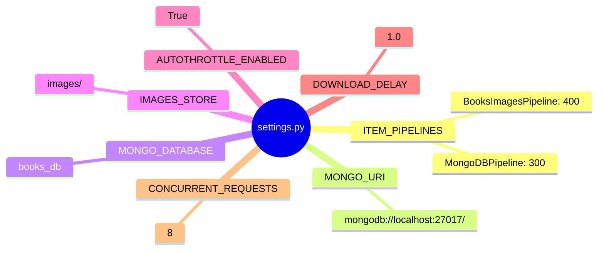

<div align="center">

 


</div>

## **Les prérequis techniques**
Composant	Version	Installation  
Python	3.10 est plus récent ➜ "python.org"  
MongoDB	7 est plus récent ➜ "docs.mongodb.com"  
pip	23+	`python -m pip install --upgrade pip`
### 1. Installer MongoDB​
1.1. Téléchargement & installation
```sh
# macOS (Homebrew)
brew tap mongodb/brew
brew install mongodb-community@7.0

# Ubuntu/Debian
wget -qO - https://www.mongodb.org/static/pgp/server-7.0.asc | sudo apt-key add -
echo "deb [ arch=amd64,arm64 ] https://repo.mongodb.org/apt/ubuntu jammy/mongodb-org/7.0 multiverse" | sudo tee /etc/apt/sources.list.d/mongodb-org-7.0.list
sudo apt-get update
sudo apt-get install -y mongodb-org

# Windows
# Télécharger MSI depuis mongodb.com → Next/Next/Finish
```
### 1.2. Démarrage du service
```sh
# Linux/macOS (service)
sudo systemctl start mongod
sudo systemctl enable mongod  # Auto-démarrage

# macOS (Homebrew)
brew services start mongodb/brew/mongodb-community@7.0

# Windows
net start MongoDB

# Manuel (tous OS)
mongod --dbpath /data/db  # Créer dossier avant
```
### 1.3. Vérification
```sh
mongosh
> db.version()  # → 7.0.x
> exit
```
### 2. Structure du projet
```txt
mongoBooks/
├── mongo.py
├── items.py
├── pipelines.py
├── middleware.py
├── queries.py
├── scrapy.cfg
├── settings.py
├── requirements.txt
└── images/
```
### 3. Environnement virtuel
```sh
# Créer dossier projet
mkdir mongoBooks && cd mongoBooks

# Copier tes fichiers .py ici

# Environnement virtuel
python -m venv .venv

# Activer
source .venv/bin/activate          # Linux/macOS
# OU
.venv\Scripts\activate             # Windows (PowerShell/cmd)

# Vérifier
which python  # → .../.venv/bin/python
```
### 4. requirements.txt
```py
scrapy==2.11.2
pymongo==4.6.3
itemadapter==0.9.0
w3lib==2.1.2
lxml==5.2.1
```
Installer
```sh
pip install -r requirements.txt
```
Vérifier
```sh
scrapy version  # → Scrapy 2.11.2
python -c "import pymongo; print(pymongo.version)"  # → 4.6.3
```
## **Le fichier `settings.py`**
