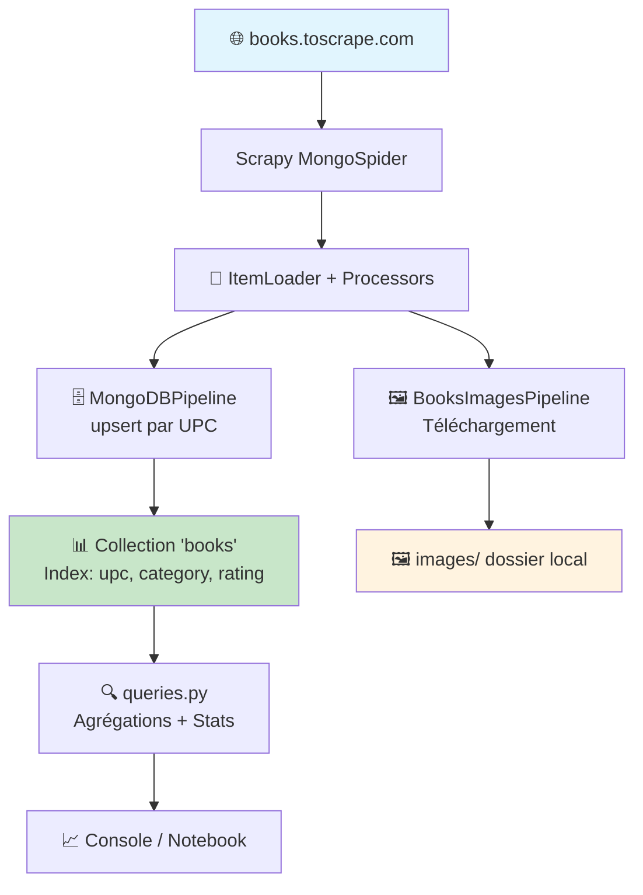
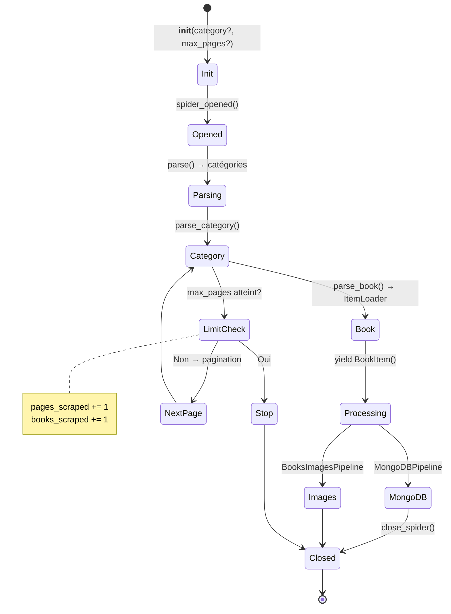
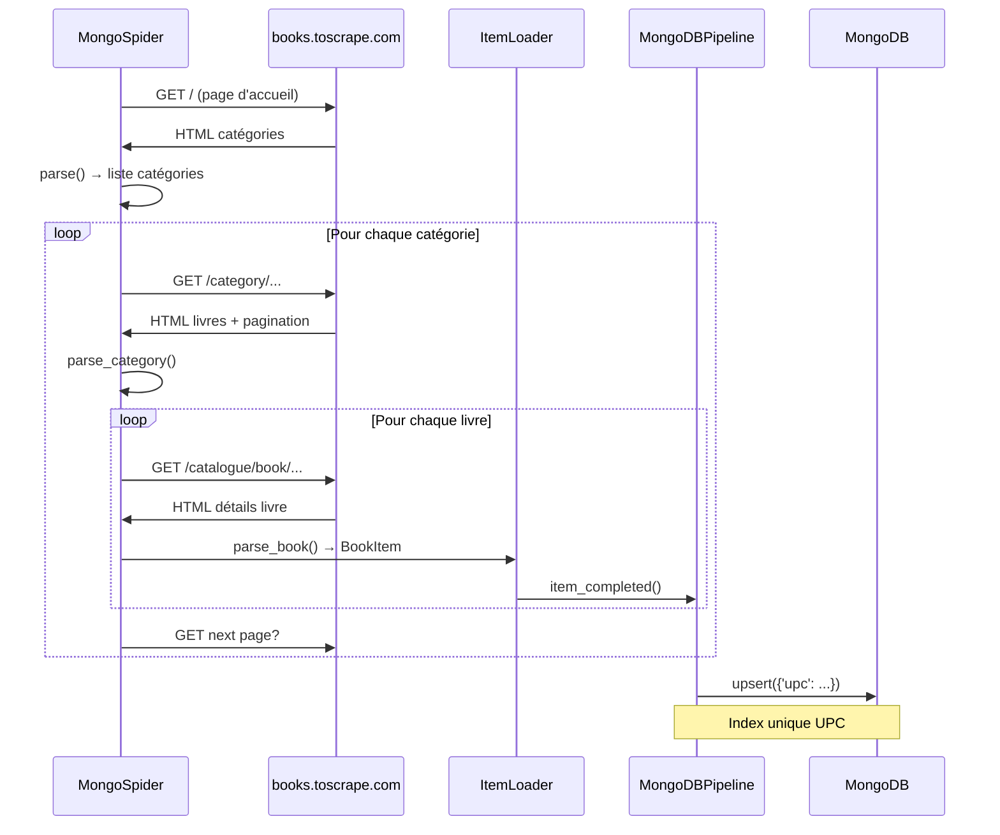

# **Books to MongoDB**<a href="../../"></a>
<div align="center">

 
 
 
 


</div><hr>

Un scraper  pour extraire et stocker les données de livres depuis [books.toscrape.com](https://books.toscrape.com) dans MongoDB.  
Ce projet permet de scraper automatiquement les informations détaillées de milliers de livres (titre, prix, disponibilité, images, etc.) et de les stocker dans une base MongoDB locale avec téléchargement automatique des images de couverture.
---
### ✨ Les principals fonctionnalités<a href="#"></a>
* 📖 Scraping de toutes les catégories de livres
* 💾 Stockage automatique dans MongoDB
* 🖼️ Téléchargement des images de couverture
* 🔍 Filtrage par catégorie
* 📊 Limitation du nombre de pages
* 🔄 Gestion de la pagination automatique
* ⚡ Optimisé avec indexation MongoDB
* 📈 Statistiques et logs détaillés
## **📋 Les prérequis**
* 
* -47A248?style=flat&logo=mongodb&logoColor=white)
* 
## **🚀 L'installation**
### 1. Cloner le projet
```sh
git clone <votre-repo>
cd b2mongo
```
### 2. Créer l'environnement virtuel
```sh
python -m venv venv
source venv/bin/activate  # Linux/Mac
venv\Scripts\activate     # Windows
```
### 3. Installer les dépendances
```sh
pip install scrapy pymongo pillow
```
### 4. Démarrer MongoDB
```sh
# Linux/Mac
sudo systemctl start mongod

# Windows
net start MongoDB

# Vérifier que MongoDB est accessible
mongosh
```
## **📖 Utilisation rapide**
### Scraper tous les livres
```sh
scrapy crawl mongo
```
### Scraper une catégorie spécifique
```sh
scrapy crawl mongo -a category="Fiction"
scrapy crawl mongo -a category="History"
```
### Limiter le nombre de pages
```sh
scrapy crawl mongo -a max_pages=5
```
### Combiner les options
```sh
scrapy crawl mongo -a category="Science Fiction" -a max_pages=10
```
### Exporter en CSV/JSON
```sh
scrapy crawl mongo -O books.csv
scrapy crawl mongo -O books.json
```
## **📊 La structure des données**
Chaque livre contient :
Champ | Type | Description
---|---|---
`title` | string | Titre du livre
`url` | string | URL de la page
`upc` | string | Code produit unique (clé)
`price_excl_tax` | float | Prix HT
`price_incl_tax` | float | Prix TTC
`tax` | float | Montant de la taxe
`availability` | int | Nombre en stock
`rating` | int | Note (1-5)
`category` | string | Catégorie
`description` | string | Description
`number_of_reviews` | int | Nombre d'avis
`image_url` | string | URL de l'image
`image_path` | string | Chemin local de l'image
## **🗂️ La structure du projet**
```
b2mongo/
├── scrapy.cfg              # Configuration Scrapy
├── b2mongo/
│   ├── __init__.py
│   ├── items.py           # Définition des items BookItem
│   ├── middlewares.py     # Middlewares (standard)
│   ├── pipelines.py       # MongoDB + Images pipelines
│   ├── settings.py        # Configuration globale
│   ├── queries.py         # Exemples de requêtes MongoDB
│   └── spiders/
│       └── mongo.py       # Spider principal
└── images/                # Images téléchargées (auto-créé)
```
## **La structure du spyder**

### **L'état du spyder**

### **Les flux de données du spider**

## **📊 Diagrammes et architecture**
Pour une compréhension visuelle du projet :
- **[Architecture complète](ARCHITECTURE.md)** - Documentation technique avec diagrammes intégrés
- **[Collection de diagrammes](DIAGRAMS.md)** - Tous les diagrammes en un seul endroit
- **[Requêtes MongoDB](USAGE.md#requêtes-mongodb)** - Diagrammes des agrégations
## **⚙️ La configuration**
### **MongoDB (`settings.py`)**
```py
MONGO_URI = 'mongodb://localhost:27017/'
MONGO_DATABASE = 'books_toscrape'
```
### **Politesse du scraping**
```py
DOWNLOAD_DELAY = 0.5                   # Délai entre requêtes
CONCURRENT_REQUESTS_PER_DOMAIN = 2    # Requêtes simultanées
ROBOTSTXT_OBEY = True                 # Respecter robots.txt
```
### **Pipelines actifs**
```py
ITEM_PIPELINES = {
    'b2mongo.pipelines.BooksImagesPipeline': 200,  # Téléchargement images
    'b2mongo.pipelines.MongoDBPipeline': 300,      # Stockage MongoDB
}
```
## **🔍 Les requêtes MongoDB**
Pour les exemples de requêtes voir `queries.py` :
```py
from pymongo import MongoClient

client = MongoClient('mongodb://localhost:27017/')
db = client['books_toscrape']
books = db['books']

# Livres les mieux notés
top_rated = books.find({'rating': 5}).limit(10)

# Prix moyen par catégorie
pipeline = [
    {'$group': {
        '_id': '$category',
        'avg_price': {'$avg': '$price_incl_tax'},
        'count': {'$sum': 1}
    }},
    {'$sort': {'avg_price': -1}}
]
results = books.aggregate(pipeline)

# Recherche full-text
books.create_index([('title', 'text'), ('description', 'text')])
results = books.find({'$text': {'$search': 'python programming'}})
```
## **📚 La documentation complète**
* **[USAGE.md](USAGE.md)** - Guide d'utilisation détaillé
* **[ARCHITECTURE.md](ARCHITECTURE.md)** - Documentation technique
* **[TROUBLESHOOTING.md](TROUBLESHOOTING.md)** - Résolution de problèmes
* **[ETHICS.md](ETHICS.md)** - Éthique et bonnes pratiques
* **[CONTRIBUTING.md](CONTRIBUTING.md)** - Guide pour contributeurs
## **⚖️ Éthique et légalité**
Ce projet est conçu **uniquement à des fins éducatives** sur le site de démonstration [books.toscrape.com](https://books.toscrape.com), créé spécifiquement pour l'apprentissage du scraping.

⚠️ **Important** : Ne pas utiliser ce code sur des sites de production sans permission. Voir [ETHICS.md](ETHICS.md) pour plus de détails.
## **📝 Licence**
MIT License - Voir LICENSE pour plus de détails.
___
> **NOTA**  
>  Ce projet respecte les règles du `robots.txt` et implémente des délais entre requêtes pour un scraping responsable.