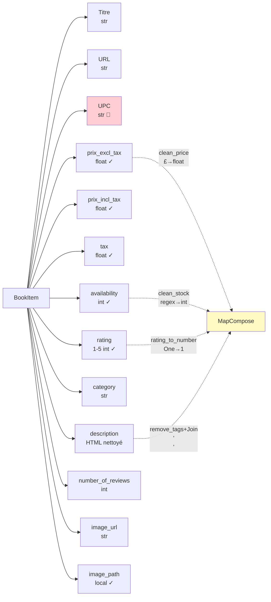

<div align="center">


</div>

## **Le lancement du Spider**
### **Les prérequis**
MongoDB démarré sur localhost:27017​
L'environnement virtuel est activé avec scrapy et pymongo
Le dossier `images/` est créé (pour `IMAGES_STORE`)
## **La structure d'exécution**
```sh
mongoBooks/          # Dossier projet
├── mongo.py         # Spider principal
├── items.py
├── pipelines.py
├── queries.py
├── scrapy.cfg       # OU settings.py
└── images/          # Créer ce dossier
```
### 1. Les commandes de base
Spider complet (toutes catégories)
```sh
scrapy crawl mongo
Résultat attendu : ~1000 livres scrapés, stockés en books_db.books​

Filtre par catégorie
bash
# Seulement "Travel"
scrapy crawl mongo -a category=Travel

# Seulement "Python" (insensible à la casse)
scrapy crawl mongo -a category=python
Limite de pages par catégorie
bash
# Max 3 pages/catégorie (plus rapide pour tests)
scrapy crawl mongo -a max_pages=3

# Catégorie + limite
scrapy crawl mongo -a category=Travel -a max_pages=2
```
### 2. Les logs de suivi​
Le spider affiche en temps réel :
```txt
🚀 Le spider démarre
📚 21 catégories trouvées
📖 Scraping de la catégorie Travel
📕 20 livres trouvés dans Travel
➡️ Page suivante (page 2/50)
50 livres scrapés
✅ La collection Travel est complète
✅ 987 livres stockés
```
### 3. Vérification MongoDB
```sh
# Ouvrir MongoDB shell
mongosh

# Vérifier les données
use books_db
db.books.countDocuments()           # → ~1000
db.books.findOne()                 # Premier livre
db.books.distinct("category")      # Liste catégories
```
Collections créées automatiquement :​
books : documents BookItem (index upc unique)
Index : upc, category, rating
### 4. Les images téléchargées
Les couvertures sont dans ./images/full/ :
```txt
images/
└── full/
    ├── 9780132354526.jpg
    ├── 9780440237220.jpg
    └── ...
```
Champs enrichis :​
image_url : URL originale
image_path : "full/9780132354526.jpg"
### 5. Analyses avec queries.py
```sh
python queries.py
```
Sortie console :​
```txt
Total livres: 1000
# Top 10 rating 5
"It's Only the Himalayas" - 53.99£
# Catégories
Counter({'Default': 1000, 'Travel': 50, ...})
# Prix moyen/catégorie
Travel: 45.23£ (50 livres)
Poetry: 38.99£ (45 livres)
# Stats globales
{'total': 1000, 'avg_price': 32.85, 'max_price': 59.99, 'min_price': 9.99}
```
### ⚙️ 6. settings.py obligatoires​
Ajouter dans ton settings.py (ou créer si absent) :
```py
# Pipelines (ordre important !)
ITEM_PIPELINES = {
    'mongoBooks.pipelines.MongoDBPipeline'  : 300,
    'scrapy.pipelines.images.ImagesPipeline': 400,
}

# MongoDB
MONGO_URI = 'mongodb://localhost:27017/'
MONGO_DATABASE = 'books_db'

# Images
IMAGES_STORE = 'images'

# Respect du site (éthique)
DOWNLOAD_DELAY = 1.0
AUTOTHROTTLE_ENABLED = True
CONCURRENT_REQUESTS = 8
```
### 7. Modes de test rapides
Objectif	Commande	Durée estimée	Livres
Test rapide	scrapy crawl mongo -a max_pages=1	2min	~20
Une catégorie	scrapy crawl mongo -a category=Travel	5min	~50
Complet	scrapy crawl mongo	15min	~1000
Debug	scrapy crawl mongo -s LOG_LEVEL=DEBUG	-	-
### 8. Exports avancés
JSON pour notebooks
```sh
scrapy crawl mongo -o books.json
````
CSV (Pandas-ready)
```sh
scrapy crawl mongo -o books.csv
```
Via MongoDB → Pandas
```py
# Dans un notebook
from pymongo import MongoClient
import pandas as pd

client = MongoClient()
df = pd.DataFrame(list(client.books_db.books.find()))
df.to_csv('books_clean.csv', index=False)
```
### 9. Commandes utiles
```sh
# Shell Scrapy (tester XPath)
scrapy shell 'https://books.toscrape.com/'

# Voir structure site
scrapy view https://books.toscrape.com/

# Logs détaillés
scrapy crawl mongo -s LOG_LEVEL=INFO

# Stats du spider
scrapy crawl mongo -s LOGSTATS=True
```
## **La structure de BookItems**
