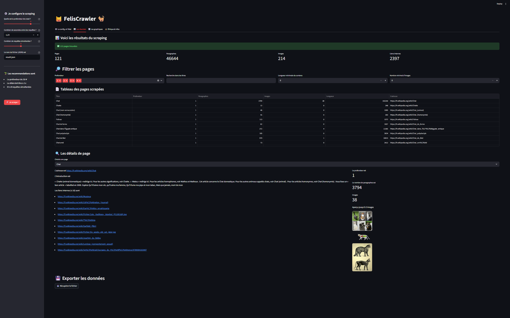
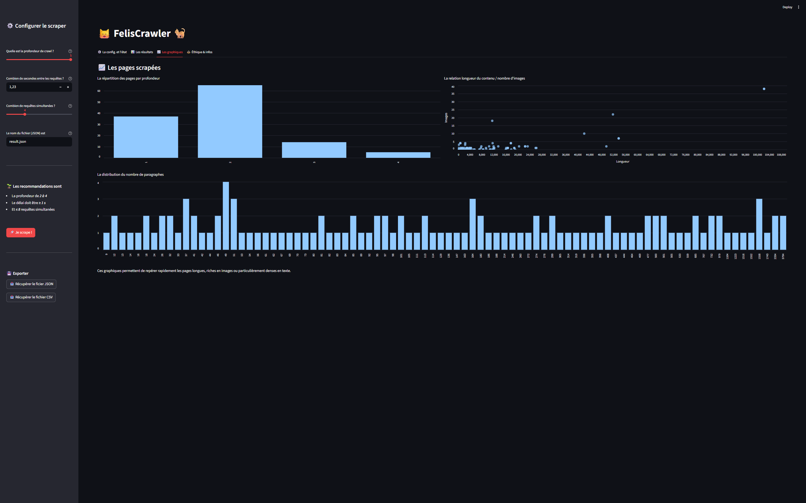

# **FelisCrawler**<a href="../../"></a>
<div align="center">

 
 
 
 
 


</div>

"**FelisCrawler**" est une application de web scraping pédagogique. Elle explore automatiquement les articles Wikipédia liés aux chats. Elle combine un spider Scrapy performant avec une interface Streamlit interactive pour configurer, exécuter et visualiser vos extractions de données.
---
**🎯 Cas d'usage** 👉 Apprentissage du web scraping, analyse de contenu encyclopédique, étude de graphes de liens.
___

<a href="#"></a>

## **Les principaux composants du projet sont**
* Un spider Scrapy avancé multi règles, conçu pour explorer en profondeur les liens encyclopédiques autour des chats sur Wikipédia.
* L'interface utilisateur graphique avec Streamlit. Elle centralise la configuration, le lancement du scraping, la visualisation des résultats (statistiques, tableaux, graphiques) et la documentation éthique.
## **Les principales fonctionnalités sont**
* Un scraping exhaustif de Wikipédia sur la thématique féline (avec le suivi intelligent des liens pertinents et filtrage)
* Le contrôle total des paramètres
  * La profondeur de crawl
  * Le délai minimum entre requêtes (pour le respect des serveurs)
  * Le nombre de requêtes simultanées
  * Le nom du fichier de sortie.

* La visualisation instantanée des résultats du scraping
  * La quantité de pages, paragraphes, images, liens internes
  * Le tableau filtrable des articles
  * Les fiches détaillées par article (titre, intro, liens internes, images) ;
  * Les graphiques interactifs
    * La répartition par profondeur, 
    * La distribution des paragraphes,
    * La relation longueur/nombre d’images.

* Le téléchargement à la demande des résultats en JSON
* Une documentation sur l’éthique, l’impact environnemental du scraping, le RGPD et les bonnes pratiques
## **L'architecture du projet**
```
felisCrawler/
├── app.py                             # Interface Streamlit principale
├── utils.py                           # Fonctions utilitaires
├── run_tests.py                       # Script de lancement des tests
├── wikipedia/
│   └── spiders/
│       └── feliscrawler_spider.py     # Spider Scrapy (CrawlSpider)
├── tests/                             # Suite de tests (25 tests, 86% couverture)
│   ├── test_integrity.py              # Tests d'extraction de données
│   ├── test_structure.py              # Tests de structure HTML (live)
│   ├── test_live_structure.py         # Tests live (flag --live)
│   ├── test_edge_cases.py             # Tests de cas limites
│   ├── test_navigation.py             # Tests de filtrage des liens
│   ├── test_e2e.py                    # Tests end-to-end
│   ├── test_app_ui.py                 # Tests de l'interface Streamlit
│   ├── test_components.py             # Tests des composants UI
│   ├── test_settings.py               # Tests de configuration
│   └── test_utils.py                  # Tests des utilitaires
├── requirements.txt                   # Dépendances Python
├── pyproject.toml                     # Configuration projet
├── scrapy.cfg                         # Configuration Scrapy
└── readme.md                          # Cette documentation
```
**Le spider Scrapy** scrute `fr.wikipedia.org/wiki/Chat` en suivant des règles d'exploration intelligentes :
* Suit uniquement les URL pertinentes (chats, félins, races)
* Exclut les espaces non encyclopédiques (pages meta, discussions, etc.)
* Extrait pour chaque page : titre, introduction, nombre de paragraphes, longueur texte, liens internes, images filtrées et profondeur

**L'interface Streamlit** centralise toutes les fonctionnalités :
* Configuration intuitive via la sidebar
* Lancement du scraping en un clic (génère un sous-processus Scrapy)
* Visualisation interactive avec filtrage et recherche
* Statistiques et graphiques dynamiques
* Documentation sur l'éthique et la gouvernance du scraping
## **🚀 Démarrage rapide**
**Prérequis** 👉 Python 3.9 ou ultérieur (testé avec Python 3.13)
### **Étape 1 👉 Installer les dépendances**
```bash
pip install -r requirements.txt
```
### **Étape 2 👉 Démarrer l'application**
```sh
streamlit run app.py
```
### **Étape 3 👉 Scraper**
1. Paramétrer les options dans la barre latérale (profondeur, délai, etc.)
2. Cliquer sur **"🚀 Je scrape !"**
3. Les résultats apparaissent automatiquement dans `result.json` et `result.csv`
### **Depuis l'interface**, les actions sont
* Configurer les paramètres de scraping (profondeur, délai, concurrence)
* Lancer le scraping en un clic
* Explorer les données collectées dans les onglets interactifs
* Filtrer et rechercher dans les résultats
* Exporter au format JSON et CSV
## **Les spécificités du spider**
* Configuration fine par attributs Scrapy (profondeur, délais, concurrent, User-Agent)
* Respect du fichier '_robots.txt_'
* Extraction robuste des titres, introduction et paragraphes
* Limitation intelligente des liens internes et images extraites pour éviter les débordements
* Compatible avec tous les formats d’export supportés (FEEDS Scrapy)
## **Visualiser et analyser**
L'interface propose plusieurs outils d'analyse
* **Un tableau interactif** 👉 Filtrer les pages par profondeur, nombre d'images, longueur ou recherche textuelle dans les titres.
* **Des fiches détaillées** 👉 Pour chaque article, consulter le titre, l'URL, l'introduction, les liens internes et un aperçu des images.
* **Des graphiques dynamiques**
    * Répartition des pages par profondeur de crawl (bar chart)
    * Relation longueur de texte / nombre d'images (scatter plot)
    * Distribution du nombre de paragraphes par page (histogramme)

<details>
<summary>Exemple de données extraites</summary>

```json
{
    "url": "https://fr.wikipedia.org/wiki/Chat",
    "titre": "Chat",
    "profondeur": 0,
    "introduction": "Le Chat domestique (Felis silvestris catus) est la sous-espèce...",
    "nombre_paragraphes": 142,
    "longueur_contenu": 45231,
    "nombre_images": 38,
    "liens_internes": [
        "https://fr.wikipedia.org/wiki/Felis_silvestris",
        "https://fr.wikipedia.org/wiki/Félins",
        "https://fr.wikipedia.org/wiki/Domestication_du_chat"
    ],
    "images": [
        "//upload.wikimedia.org/wikipedia/commons/thumb/0/0b/Cat_poster_1.jpg/260px-Cat_poster_1.jpg",
        "//upload.wikimedia.org/wikipedia/commons/thumb/b/bb/Kittyply_edit1.jpg/220px-Kittyply_edit1.jpg"
    ]
}
```
</details>

## **Éthique, gouvernance et bonnes pratiques**
Le scraping limité à un usage expérimental et pédagogique. Il respecte explicitement les règles Wikipédia (licence CC BY-SA, attribution requise). Il n'y a pas de collecte de données personnelles dans le périmètre du projet. 
Le respect de l’environnement est possible par la modulation des paramètres pour minimiser l’impact carbone et éviter de surcharger le serveur.
## **Licence**
* **Le code** 👉 [voir le fichier `LICENSE`](LICENSE) à la racine du projet pour la licence du code source.
* **Les données extraites** depuis Wikipédia sont soumises à [la licence Wikipédia `CC BY‑SA`](https://fr.wikipedia.org/wiki/Wikip%C3%A9dia:Droit_d%27auteur).
___



___
## **Les tests**
Pour garantir la pérennité du scraper face aux évolutions de Wikipédia, une **suite de tests complète** est incluse.
<!--### **Résumé**
* **48 tests** réussis (100% de réussite)
* **90%** de couverture globale
* **12 types de tests** : intégrité, structure, cas limites, navigation, end-to-end, UI, middlewares, coverage, etc.
### **Commandes rapides**
```bash
# Tous les tests
python run_tests.py
# Tests avec couverture
coverage run -m unittest discover && coverage report -m
# Tests live (réseau requis)
python run_tests.py --live
# Analyse statique
ruff check .
mypy .
```-->
Pour plus de détails sur chaque type de test, exemples, troubleshooting et guide de contribution aux tests

👉 **[Consulter testing.md](testing.md)**

<details>
<summary>Les problèmes courants</summary><hr>

#### **Erreur 👉 `ModuleNotFoundError: No module named 'scrapy'`**
#### **Solution** 👉 Installez les dépendances avec `pip install -r requirements.txt`
#### **Aucune donnée scrapée / Fichier JSON vide**
#### **Causes possibles**
* Connexion internet indisponible
* Wikipedia est inaccessible
* Les sélecteurs CSS/XPath ont changé (structure HTML modifiée)
#### **Solution** 👉 Lancer `python run_tests.py` pour vérifier si les tests de structure détectent des changements
#### **Tests échouent**
#### **Solution** 
* Utiliser `python run_tests.py` pour la suite complète sans tests réseau
* Utiliser `python run_tests.py --live` pour inclure les tests nécessitant une connexion internet
* Avoir Python 3.9+ 👉 `python --version`
#### **L'application Streamlit ne démarre pas**
#### **Solution** 
* Vérifier que Streamlit est installé 👉 `pip show streamlit`
* Réinstaller si nécessaire 👉 `pip install --upgrade streamlit`
* Utiliser la commande complète 👉 `streamlit run app.py`
#### **Erreur RGPD / Robots.txt**
Le spider respecte automatiquement `robots.txt` grâce à `ROBOTSTXT_OBEY=True`. Si vous rencontrez des blocages, augmentez le délai entre requêtes dans l'interface.

</details><hr>

## **Références et documentation**
[Scrapy — Spiders](https://docs.scrapy.org/en/latest/topics/spiders.html)  
[Scrapy — Sélecteurs XPath](https://docs.scrapy.org/en/latest/topics/selectors.html)  
[Scrapy — Paramètres de pipeline et exports](https://docs.scrapy.org/en/latest/topics/feed-exports.html)  
[Documentation de Streamlit](https://docs.streamlit.io/)  
[Licences et conditions d’utilisation de Wikipédia](https://fr.wikipedia.org/wiki/Wikip%C3%A9dia:Droit_d%27auteur)  
[Récapitulatif du RGPD](https://www.cnil.fr/fr/rgpd-par-ou-commencer)

<hr><div align="center">

**FelisCrawler** est conçu pour illustrer l’intégration de technologies de scraping et d’interface utilisateur dans un contexte pédagogique et gouverné.