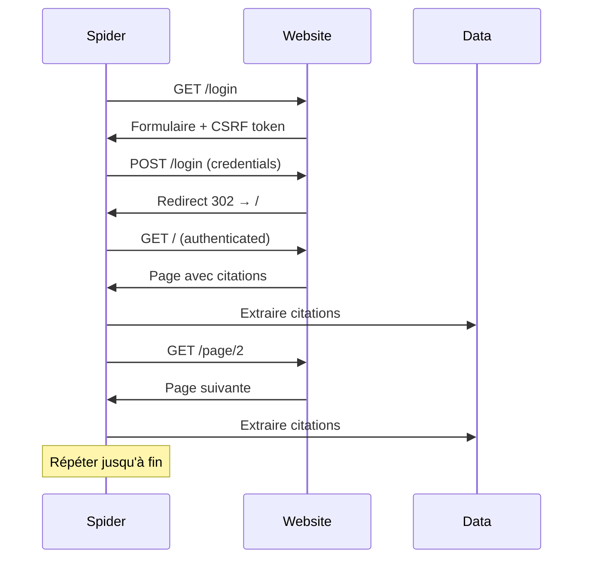

# **LoginQuotes**<a href="../../"></a>
<div align="centger">


</div><hr>

C'est un spider avancé pour extraire des citations depuis "`quotes.toscrape.com`" avec authentification automatique et pagination.
---
## Les fonctionnalités
* **Authentification automatique** avec la gestion du CSRF token
* **Pagination intelligente** pour scraper toutes les pages
* **Nettoyage des données** (suppression des guillemets)
* **Logs détaillés** pour suivre la progression
* **Gestion des cookies** automatique
* **Respect du robots.txt**
* **Rate limiting** (1 requête/seconde)
* **Export JSON/CSV/XML** supporté
## Les prérequis
* **Python** >= 3.8
* **pip** (gestionnaire de paquets Python)
* **Environnement virtuel** (recommandé)
### Les technologies utilisées
Technologie | Version | Description
---|---|---
 | 3.13.9 | Langage de programmation
 | 2.13.4 | Framework de web scrapin|
 | 6.0.2 | Parser XML/HTML
 | 25.5.0 | Framework asynchrone
 | 3.5.4 | Sécurité SSL/TLS
## **La structure du projet**
```
loginQuotes/
├── loginQuotes/
│   ├── __init__.py
│   ├── settings.py          # Configuration Scrapy
│   ├── middlewares.py       # Middlewares personnalisés
│   ├── pipelines.py         # Pipelines de traitement
│   └── spiders/
│       ├── __init__.py
│       └── login.py         # 🕷️ Spider principal
├── scrapy.cfg               # Configuration du projet
├── data.json                # 📄 Données extraites
├── requirements.txt         # Dépendances Python
└── README.md                # Documentation
```
## **L'utiliser**
### **La commande de base**
```bash
scrapy runspider loginQuotes/spiders/login.py -O data.json
```
### **Les options d'export**
**JSON :**
```bash
scrapy runspider loginQuotes/spiders/login.py -O data.json
```
**CSV :**
```bash
scrapy runspider loginQuotes/spiders/login.py -O data.csv
```
**XML :**
```bash
scrapy runspider loginQuotes/spiders/login.py -O data.xml
```
**JSON Lines (pour gros volumes) :**
```bash
scrapy runspider loginQuotes/spiders/login.py -O data.jsonl
```
### **Les options avancées**
**Mode verbose (debug):**
```bash
scrapy runspider loginQuotes/spiders/login.py -O data.json -L DEBUG
```
**Limiter le nombre de pages:**
```bash
scrapy runspider loginQuotes/spiders/login.py -O data.json -s CLOSESPIDER_PAGECOUNT=5
```
**Désactiver le rate limiting:**
```bash
scrapy runspider loginQuotes/spiders/login.py -O data.json -s DOWNLOAD_DELAY=0
```
## **L'installation**
### **Cloner le projet**
```bash
git clone https://github.com/votre-username/loginQuotes.git
cd loginQuotes
```
### **Créer l'environnement virtuel**
```bash
pip install -r requirements.txt
```
Le fichier _**requirements.txt:**_
```py
scrapy==2.13.4
lxml==6.0.2
twisted==25.5.0
pyOpenSSL==25.3.0
cryptography==46.0.3
```
## **La configuration**

<details open>
<summary>Voir</summary>

### **settings.py**
```python
# Identification du bot
BOT_NAME = 'loginQuotes'
SPIDER_MODULES = ['loginQuotes.spiders']

# Respect des règles
ROBOTSTXT_OBEY = True

# Rate limiting
DOWNLOAD_DELAY = 1  # secondes entre chaque requête
CONCURRENT_REQUESTS_PER_DOMAIN = 1

# Encodage
FEED_EXPORT_ENCODING = 'utf-8'

# User-Agent
USER_AGENT = 'loginQuotes (+http://www.yourdomain.com)'
```
### **Personnaliser les credentials**
Modifiez dans `login.py`:
```python
formdata={
    "csrf_token": token,
    "username": "votre_username",  # ← Changez ici
    "password": "votre_password"    # ← Changez ici
}
```

</details>

## **L'architecture**
### **Les flux de fonctionnement**
```
1. start() 
   ↓
2. parse_login() → Extraction du CSRF token
   ↓
3. FormRequest → Soumission du formulaire
   ↓
4. parse() → Vérification connexion (bouton Logout)
   ↓
5. Extraction des citations
   ↓
6. Pagination (lien Next)
   ↓
7. Répéter étape 5-6 jusqu'à la dernière page
```
### **Le diagramme de séquence**

## **Exemples de sortie**
### **Format JSON**
```json
[
  {
    "text": "The world as we have created it is a process of our thinking.",
    "author": "Albert Einstein",
    "tags": ["change", "deep-thoughts", "thinking", "world"]
  },
  {
    "text": "It is our choices that show what we truly are.",
    "author": "J.K. Rowling",
    "tags": ["abilities", "choices"]
  }
]
```
## 🐛 Dépannage

<details open>
<summary>Voir</summary>

### Problème: AttributeError 'int' object has no attribute 'getall'
**Cause:** Parenthèses mal placées dans l'XPath
**Solution:**
```python
# ❌ Incorrect
if len(response.xpath('//a')).getall():

# ✅ Correct
if response.xpath('//a'):
```
### Problème: Connexion échoue (pas de bouton Logout)
**Vérifications:**
1. Username/password corrects dans `formdata`
2. Le CSRF token est bien extrait
3. Les cookies sont activés (par défaut dans Scrapy)

**Debug:**
```python
def parse(self, response):
    self.logger.debug(f"Response URL: {response.url}")
    self.logger.debug(f"Cookies: {response.request.headers.get('Cookie')}")
```
### Problème: DeprecationWarning start_requests()
**Solution:** Utiliser `async def start()` au lieu de `def start_requests()`
### Problème: Bloqué par le serveur (403/429)
**Solutions:**
* Augmenter `DOWNLOAD_DELAY`
* Ajouter un User-Agent réaliste
* Utiliser des proxies rotatifs
* Implémenter un middleware de `retry`

</details>