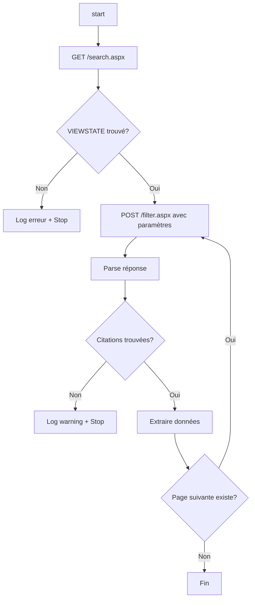
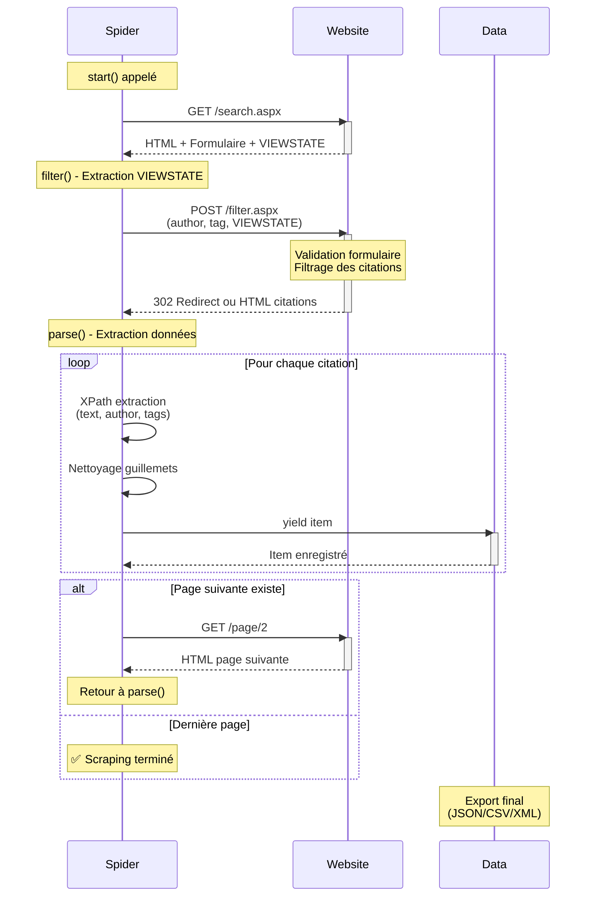

# XHR Spider - Scraper de citations par Le filtrage dynamique<a href="../../"></a>
<div align="center">


</div><hr>

L'API JavaScript "`XMLHttpRequest`" est intégrée aux navigateurs permettant d’envoyer des requêtes HTTP ou HTTPS de manière asynchrone ; sans recharger la page entière.  
Le but est d'extraire des citations filtrées par auteur et tag depuis quotes.toscrape.com avec gestion du `VIEWSTATE` "ASP.NET" et pagination automatique.
---
## **Les fonctionnalités**
* **Filtrage dynamique** par auteur et tag via paramètres CLI
* **Gestion du '`VIEWSTATE`'** (protection CSRF ASP.NET)
* **Pagination automatique** pour scraper tous les résultats
* **Logs enrichis** avec des informations détaillées
* **Gestion d'erreurs** robuste avec '`errback'`
* **Nettoyage automatique** des guillemets
* **Paramètres configurables** sans modifier le code
* **Export multi-formats** (`JSON`, `CSV`, `XML`, `JSONL`)
* **Async/await support** (Scrapy 2.13+)
## **Les technologies**
### Le stack principal
Technologie | Version | Rôle | Badge
---|---|---|---
**Python** | 3.13.9 | Langage de programmation | 
**Scrapy** | 2.13.4 | Framework de web scraping | 
**lxml** | 6.0.2 | Parser HTML/XML | 
**Twisted** | 25.5.0 | Framework réseau asynchrone | 
### Les protocoles & standards
Standard | Usage |
---|---
 | Sélection d'éléments DOM
 | Protocole de communication
 | Soumission de formulaires
 | Gestion d'état côté serveur
## **Les prérequis**
* **Python** >= 3.8
* **pip** >= 21.0
* **Git** (optionnel)
## 📦 Installation
```bash
pip install -r requirements.txt
```
## **L'utiliser**
```bash
scrapy crawl xhr_spider.py -O data.json
```
## **L'architecture**
### Le flux de fonctionnement

### **Le diagramme de séquence**

### **La structure du projet**
```python
class XhrSpiderSpider(scrapy.Spider):
    │
    ├── __init__()          # Initialisation avec paramètres CLI
    │
    ├── start()             # Point d'entrée (async)
    │   └── GET /search.aspx
    │
    ├── filter()            # Extraction VIEWSTATE + POST formulaire
    │   ├── Extraire VIEWSTATE
    │   └── FormRequest avec formdata
    │
    ├── parse()             # Parser les résultats
    │   ├── Extraire citations
    │   ├── Nettoyer données
    │   └── Suivre pagination
    │
    └── handle_error()      # Gestion des erreurs réseau
```
## **La configuration**
### **Les paramètres du spider**
Paramètre | Type | Défaut | Description
---|---|---|---
`author` | str | "J.K. Rowling" | Auteur à rechercher
`tag` | str | "dumbledore" | Tag à filtrer
### **Les settings personnalisés**
```python
custom_settings = {
    'DOWNLOAD_DELAY'                : 1,              # Délai entre requêtes (secondes)
    'CONCURRENT_REQUESTS_PER_DOMAIN': 1,              # Nombre de requêtes parallèles
    'ROBOTSTXT_OBEY'                : True,           # Respecter robots.txt
    'FEED_EXPORT_ENCODING'          : 'utf-8'         # Encodage des exports
}
```
### Modifier les settings globaux
Éditez `settings.py` :
```python
# Rate limiting
DOWNLOAD_DELAY           =  2  # Plus lent et plus sûr
AUTOTHROTTLE_ENABLED     = True
AUTOTHROTTLE_START_DELAY =  1
AUTOTHROTTLE_MAX_DELAY   = 10

# User-Agent
USER_AGENT = 'Mozilla/5.0 (Windows NT 10.0; Win64; x64)'

# Logs
LOG_LEVEL = 'INFO'  # DEBUG, INFO, WARNING, ERROR
```
## **Dépannage**
### **Le problème 1 : Une `SyntaxError` avec les guillemets**
**Erreur :**
```sh
SyntaxError: unterminated string literal (detected at line 84)
text = text.strip('"'')
```
**Solution :**
```py
# ❌ Incorrect
text = text.strip('"'')

# ✅ Correct
text = text.strip('"')
```
### **Le problème 2 : VIEWSTATE non trouvé**
**Logs :**
```
[xhr_spider] ERROR: ❌ VIEWSTATE n'est pas trouvé
```
**Causes possibles :**
1. URL incorrecte (vérifier `/search.aspx`)
2. Structure HTML changée
3. Site bloque le scraping
**Debug :**
```py
def filter(self, response):
    # Afficher le HTML brut
    self.logger.debug(response.text[:1000])
    
    # Tester différents sélecteurs
    viewstate = response.xpath("//input[@name='__VIEWSTATE']/@value").get()
    if not viewstate:
        viewstate = response.css("input[name='__VIEWSTATE']::attr(value)").get()
```
### **Le problème 3 : Aucune citation trouvée**
**Logs :**
```
[xhr_spider] WARNING: ⚠️ Aucune citation trouvée pour Einstein / science
```
**Solutions :**
1. Vérifier l'orthographe de l'auteur
2. Vérifier que le tag existe
3. Inspecter la réponse HTML
**Debug :**
```py
def parse(self, response):
    # Sauvegarder la page pour inspection
    with open('debug.html', 'w', encoding='utf-8') as f:
        f.write(response.text)
```
### **Le problème 4 : Bloqué par le serveur (403/429)**
**Solutions :**
**1. Augmenter le délai :**
```sh
scrapy runspider xhr_spider.py -s DOWNLOAD_DELAY=3
```
**2. Changer le User-Agent :**
```py
custom_settings = {
    'USER_AGENT': 'Mozilla/5.0 (Windows NT 10.0; Win64; x64) AppleWebKit/537.36'
}
```
**3. Activer AutoThrottle :**
```py
custom_settings = {
    'AUTOTHROTTLE_ENABLED'    : True,
    'AUTOTHROTTLE_START_DELAY':  2,
    'AUTOTHROTTLE_MAX_DELAY'  : 10
}
```
## **Les performances**
### **Les métriques typiques**
Métrique | Valeur
---|---
Pages/minute | ~60 (avec DOWNLOAD_DELAY=1)
Citations/minute | ~300-600
Temps moyen/page | 1-2 secondes
Taux de succès | >95%
### **L'optimisation**
**Pour des volumes importants :**
```py
custom_settings = {
    'CONCURRENT_REQUESTS'           : 16,
    'CONCURRENT_REQUESTS_PER_DOMAIN':  4,
    'DOWNLOAD_DELAY'                : .5,
    'AUTOTHROTTLE_ENABLED'          : True
}
```