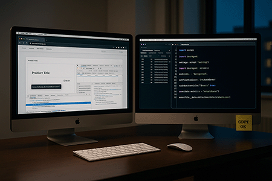

# **Web scraping**
Le web scraping est une technique consistant à extraire automatiquement des données à partir de sites web.  
Ce qui implique l'utilisation de scripts ou d'outils pour parcourir les pages web, analyser leur structure (HTML, DOM) et collecter des informations spécifiques (e.g. texte, image, lien, tableau). ​
---
## Projets avec 

1. [Quotes](projects/quotes)
2. [Books](projects/books2scrape)
3. [Quotes API](projects/quotesApi)
4. [FelisCrawler](projects/felisCrawler)

 

<!--<kbd>_In progress_</kbd>-->